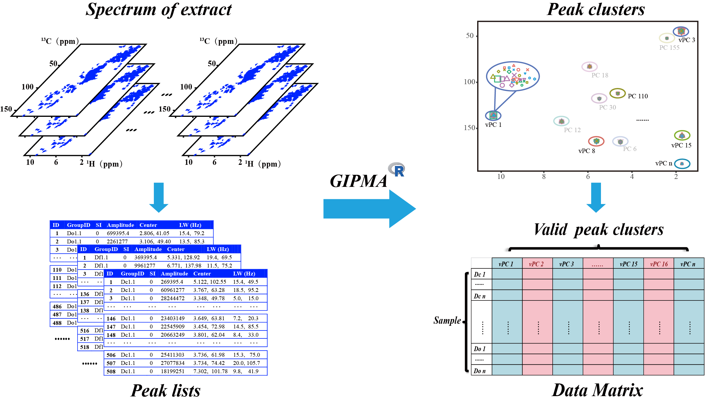

<!-- README.md is generated from README.Rmd. Please edit that file -->

# GIPMA

## Description

<div class="figure" style="text-align: left">



<p class="caption">

GIPMA

</p>

</div>

Two dimensional (2D) 1H-13C HSQC has been increasingly applied to
metabolomics study because it can greatly improve the resolving
capability compared with 1D 1H NMR. However, the preprocessing methods
such as peak matching and alignment tools for 2D NMR based metabolomics
have lagged behind similar methods for 1D 1H NMR based metabolomics.
Here, we developed an efficient peak matching and alignment algorithm
(GIPMA) for 2D 1H-13C HSQC based metabolomics, which has been
implemented in an open access R-based package called GIPMA (Intelligent
peak matching and alignment for metabolomics).

In GIPMA, fully automatic peak-wise matching and alignment do not
require any spectrum as initial reference, while chemical shift of each
vPC (or spectral feature) is updated and warranted to be statistically
more accurate by the intensity-weighted average of the chemical shifts
of all peaks in the same vPC. Accurate chemical shifts for each
representative spectral feature will facilitate subsequent peak
assignment and are essential for correct metabolite identification and
result interpretation.

[Download GIPMA](https://github.com/NMRLab-Hu/GIPMA/)

## Functions

**See the R help page for more details\!\!\!**

1."CreatSampleId": The purpose of “creatisampleid” is to generate sample
labels for distinguishing the peaks to which the sample belong and for
subsequent statistics of vPC.

2.{"Newton\_DataOrganize","Sparky\_DataOrganize","
Topspin\_DataOrganize"}: Organize the layout of CSV data that from
Newton,Sparky or Topspin, and integrate it into a data frame (Global
peak list)for the followed analysis.

3."PairingCHTol": The initial tolerance ranges of H and C chemical
shifts are estimated to be in a predefined generous tolerance range (It
is a user defined parameters).

4."SubSampling": In order to expedite the computational efficiency, a
set of representative samples were uniformly subsampled from each sample
group in case there are too many samples in multiple groups.

5."OptCHTol": Proposed an adaptive method for intelligently selecting
the optimum chemical shift tolerance by parallel hill climbing algorithm
or partial traversing search in predefined range to maximize the number
of vPC among samples.

6."DesignatePC": The intensity-ranked peaks in the global peak list were
sequentially designated to specific peak clusters in a self-adaptive
way.

7."vPCmatrix": The purpose of “vPCmatrix” is to generate the regularized
data matrix of peak intensity (M) with the different spectral features
and samples as columns and rows respectively.

8."HCmatrix": In order to facilitate the subsequent identification of
differential variables, a matrix containing the accurate chemical shifts
of vPC was generated.

## Workflow for the Matching and Alignment of 2D HSQC NMR Peaks through GIPMA

**For Demonstration Purposes Only\!\!\!**

**If you want to run the following code, you need to modify the file
path and some parameters according to your needs\!\!\!**

*install package*

``` r
install.packages("~/GIPMA_0.3.4.zip",repos = NULL)
```

*step1*

``` r
library(GIPMA)
Sample_1<-CreatSampleId(c("Dd"),7)
Sample_2<-CreatSampleId(c("Dc"),5)
Sample_3<-CreatSampleId(c("Dn"),6)
Sample_4<-CreatSampleId(c("Df"),4)
Sample_5<-CreatSampleId(c("Do"),7)
Sampleid_1<-sort(paste(c(Sample_1,Sample_2,Sample_3,Sample_4,Sample_5),
                       ".1",sep = ""))
Sampleid_2<-sort(paste(c(Sample_1,Sample_2,Sample_3,Sample_4,Sample_5),
                       ".2",sep = ""))
Sampleid_3<-sort(paste(c(Sample_1,Sample_2,Sample_3,Sample_4,Sample_5),
                       ".3",sep = ""))
Sampleid<-c(Sampleid_1,Sampleid_2,Sampleid_3)
```

*step2*

``` r
path_1<-"E:/Data analysis/raw_all_data.csv"
path_2<-"E:/Data analysis/temp.csv"
path_3<-"E:/Data analysis/All_data.csv"
All_data<-Newton_DataOrganize(path_1,path_2,path_3)
```

*step3*

``` r
H_Ltol<-0.01;H_Rtol<-0.04;C_Ltol<-0.1;C_Rtol<-0.4
C_H_tol<-PairingCHTol(H_Ltol,H_Rtol,C_Ltol,C_Rtol)
```

*step4*

``` r
path_4<-"E:/Data analysis/Sampling_data.csv"
Sampling_data<-SubSampling(3,path_4)
```

*step5*

``` r
option<-2; H_ppm<-13; C_ppm<-150
Select_C_H<-OptCHTol(option,H_ppm,C_ppm)
```

*step6*

``` r
path_5<-"E:/Data analysis/order_data.csv"
order_data<-DesignatePC(path_5,H_ppm,C_ppm)
```

*step7*

``` r
path_6<-"E:/Data analysis/SH_ft2"
path_7<-"E:/Data analysis/Final_data.csv"
Final_data<-vPCmatrix(path_6,path_7)
```

*step8*

``` r
path_8<-"E:/Data analysis/C_H_data.csv"
C_H_data<-HCmatrix(path_8)
```

## References

Huan Du, Xiu Gu, Jialuo Chen, Caihong Bai, Xiaohui Duan, Kaifeng Hu.
GIPMA: Global Intensity-guided Peak Matching and Alignment for 2D 1H-13C
HSQC based metabolomics. 2022.

## Contact

If you have any questions, please do not hesitate to contact us at
<duhuan@stu.cdutcm.edu.cn> or <kaifenghu@cdutcm.edu.cn>
